[TOC]

# 1.概述

## 1.1 信息时代的计算机网络

### 1.1.1 计算机网络应用广泛

#### 软件端

#### 硬件端

### 1.1.2  计算机网络负面问题

### 1.1.3 我国计算机网络发展情况

## 1.2 因特网概述

### 1.2.1 网络、互联网、与因特网的区别

- 网络
  - 若干节点和链路互联形成`网络`。
- 互联网（internet）`注意大小写`
  - 网络之间通过路由器互联形成`互联网`。
  - 将网络抽象为一朵“云”，那么那么互联网可以被看作为网络的网络。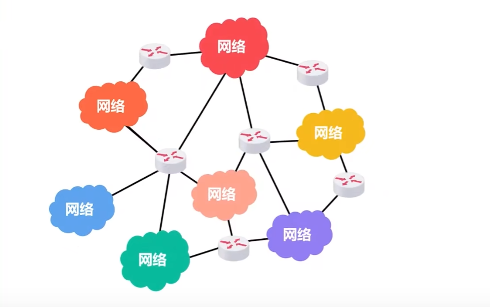
- 因特网（Internet）`专有名词使用大写`
  - `因特网`是世界上最大的互联网。

### 1.2.2 因特网的发展历程

- 三个阶段 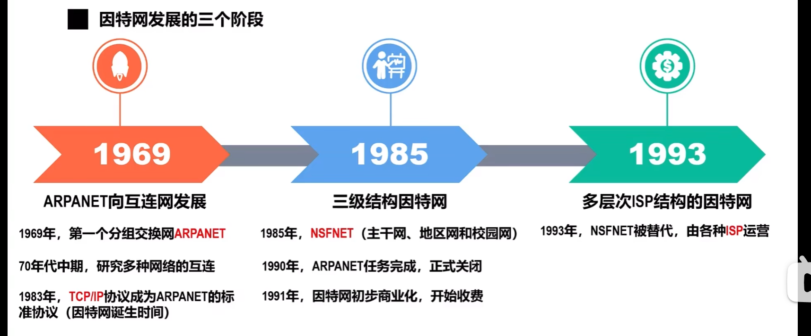

- ISP （Internet Servive Provider）
  -  提供网络接入服务的提供商。
  -  每个ISP自己搭建自己的网络
  -  不同ISP之间通过一些协议如BGP协议，实现流量交换与互通。

- 多层次ISP组网结构图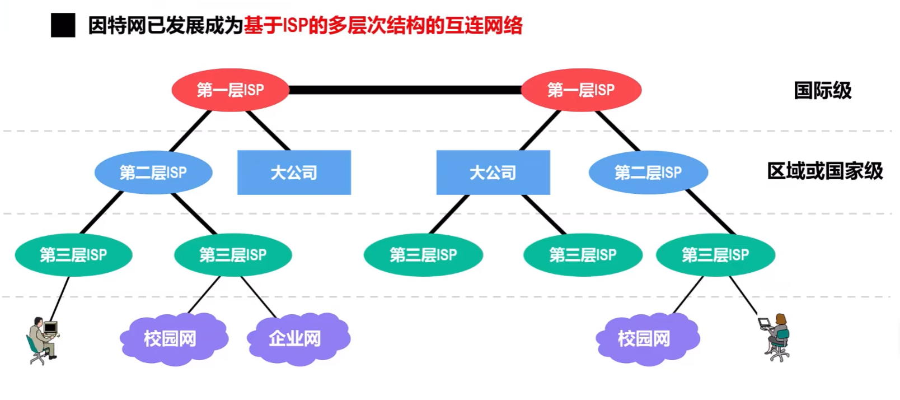

### 1.2.3 因特网的标准化工作和管理
- 标准化工作
  - **因特网的标准化工作是面向公众的**，其任何一个建议标准在成为因特网标准之前都以RFC技术文档的形式在因特网上发表。
  - **RFC（Request For Comments）的意思是“请求评论”**。任何人都可以从因特网上免费下载[RFC文档](http://www.ietf.org/rfc.html)，并随时对某个RFC文档发表意见和建议。

- 标准形成过程`2011 年之前`
- 标准形成过程`2011 年之后`
  

### 1.2.4 因特网的组成

## 1.3 电路交换 分组交换和报文交换
下面的解释按照交换技术产生的时间顺序排列。
### 电路交换
- 建立连接：在发送者和接收者之间建立`独占`信道。这条信道不能够被别的设备借用，专用与那两个设备。
- 通话：
- 释放连接：将占用的信道释放出来。

### 报文交换
- 分组交换的前身
- 不将要发送的数据包进行切分
- 交换节点必须完整接收到整个报文以后才能够进行下一次转发。存储-转发延迟较高。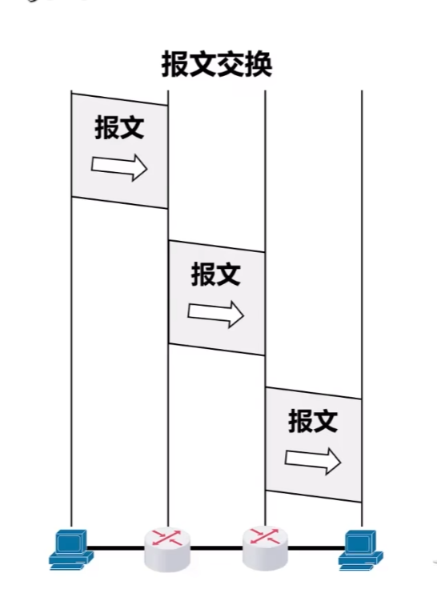
### 分组交换 
- 将报文构造为更小的分组进行分组交换
- 存储-转发延迟更低
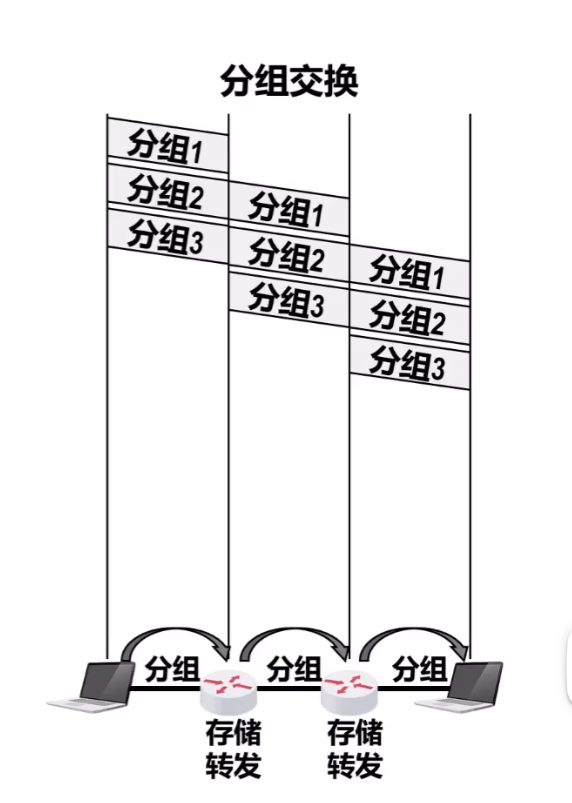

## 1.4 计算机网络的定义和分类

### 定义 
- 传统定义：互联的、自治的计算机集合。
- 与时俱进的定义：计算机网络主要是由一些通用的、可编程的硬件互联而成的，而这些硬件并非专门用来实现某一特定目的（例如，传送数据或视频信号）。这些可编程的硬件能够用来传送多种不同类型的数据，并能够支持广泛的和日益增长的应用。

### 分类
- 按交换方式：
  - 电路交换
  - 分组交换
  - 报文交换
- 按使用者分类：
  - 公用网络
  - 专用网络
- 按传输介质分类
  - 有限网络
  - 无线网络
- 按覆盖范围分类
  - `广域网`（WAN）
  - 城域网络（MAN）
  - `局域网`（LAN）
  - 个域网（PAN）
- 按拓扑结构分类
  - 总线型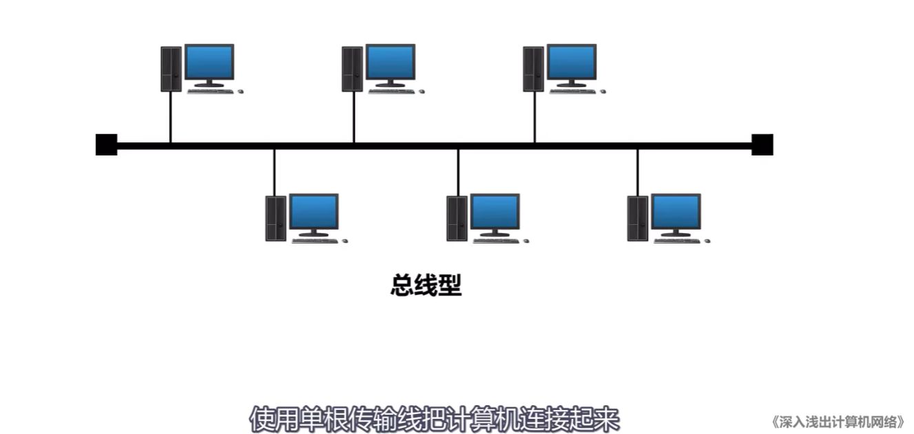
    - 优点：
    - 缺点：
  - 星型网路：
  - 环形网络：
  - 网状型网络：
## 1.5 计算机网络的性能指标
### 1.5.1 速率
单位时间传输的单位数据。

一般选取单位时间为 `s` ，单位数据量根据速率大小可以选为`1`,`K`,`M`,`G`,`T`。

**注意：**
- 在`数据量`单位中的 $\text{K、M、G、T}$的数值分别为 $2^{10}$、$2^{20}$、$2^{30}$、$2^{40}$。

- 在`速率`单位中的 $\text{K、M、G、T}$的数值分别为$10^3$、$10^6$、$10^9$、$10^{12}$。

### 1.5.2 带宽
- 带宽在模拟信号中的意义：
  - 某个信号所包含的各种不同频率成分所占据的频率范围。
  - 单位：Hz（kHz、MHz、GHz）
- 带宽在计算机网络中的意义
  - 通信线路所能传送数据的能力，即在单位时间内从网络中的某一点到另一点所能通过的最高数据速率。
  - 单位：同传输速率的单位相同。

总而言之，在计算机网络中
$$ 带宽 = \min\{\text{主机接口速率}，\text{线路带宽}，\text{交换机或路由器的速率}\} $$

### 1.5.3 吞吐量
- 吞吐量是指在`单位时间内通过某个网络或者接口的实际数据量`。吞吐量常被用于对实际网路的测量，一边获知待敌有多少数据量通过了网络。
- 吞吐量受网络带宽的限制。

### 1.5.4 时延 
- 时延是指数据从网络的一段传送到另一端所耗费的时间，也称为延迟或迟延。数据可由一个或多个分组、甚至是一个比特构成。
- $$ 时间延迟 = 发送时延迟 + \sum 传播时延 + \sum （排队时延 + 处理时延） $$
  - 发送时延 = $\frac{分组长度(b)}{发送速率(b/s)}$
  - 传播时延 = $\frac{信道长度}{信号传播速率}$
  - 排队时延 + 处理时延（路由器转发时延）：由路由器性能和前面有多少人排队决定。 
- 发送时延与传播时延谁是主导？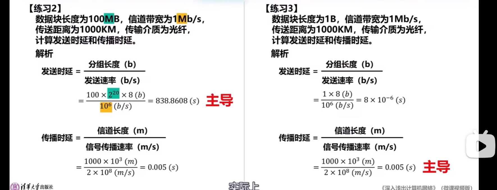
  - 发送数据量大的时候，发送时延占主导地位。
  - 发送数据量小的时候，传播时延占主导地位。
### 1.5.5 时延带宽积
$$ 时延带宽积 =带宽 \mathtt{(b/s)} \times 传播时延 \mathtt{(b/s)} $$

- 长度为1km的光纤链路的时延带宽积为多少？
  - $$ 时延带宽积 = \frac{1km}{2 \times 10^8 m/s} \times 1 Gb /s  = 5\mu s \times 1Gb/s = 5000 b  $$
### 1.5.6 往返时间 (Round-Trip Time)
RTT 指的是数据包在网络中从发送方传输到接收方，再返回发送方所需的时间。

### 1.5.7 利用率
- 链路利用率：某条链路有百分之几的时间是被利用的
- 网络利用率：网络中所有链路的链路利用率的加权平均。

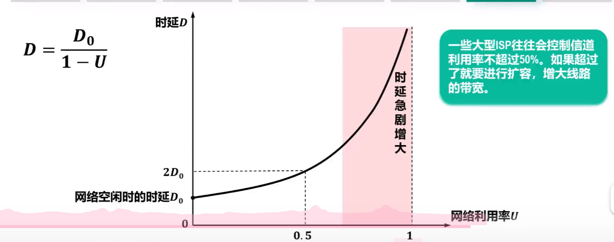

### 1.5.8 丢包率

丢包率是指在一定的时间范围内，传输过程中`丢失的分组数量与总分组数量的比率`
- 分组丢失的情况
  - 数据包出错导致的丢包：分组出现误码，被传输路径中的节点交换机（例如路由器）或目的主机检测出误码而丢弃。
  - 网络堵塞导致的丢包：节点交换机根据丢弃策略主动丢弃分组。
- 丢包率可以反映网络的拥塞情况
  - 无拥塞时路径丢包率为0
  - 轻度拥塞时为1 % ~ 4%
  - 严重拥塞时路劲丢包率为5% ~15%

## 1.6 计算机网络体系结构

### 1.6.1 常见的三种计算机网络体系结构
- OSI(Open Systems Interconnection Reference Model) 参考模型
- TCP/IP 参考模型
- 原理参考模型

### 1.6.2  计算机体系结构分层的必要性
计算机网络是一个十分复杂的系统，将计算机网络分层，可以将庞大而复杂的问题转化为若干较小的额局部问题。

1. 物理层 (physical layer)
   1. 采用什么`传输媒体`（电磁波/铜线/双绞线/同轴电缆/光纤）
   2. 采用什么`物理接口`（如RJ45以太网接口）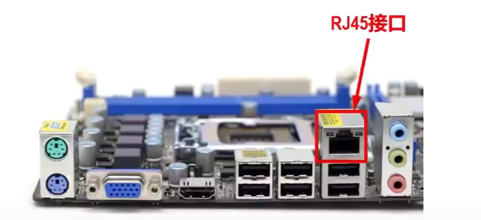
   3. 采用什么`信号`表示比特0和1
2. 数据链路层 (data link layer)
   1. 标识网络中各个主机（`主机编址`，例如MAC地址）
   2. 从比特流中区分出地址和数据  （`数据包封装格式`）
   3. 协调各个主机争用总线（`媒体接入控制`）
   4. 以太网交换机的实现（`自学习与转发帧`）
   5. 检测数据是否误码（`差错检测`）
   6. 出现传输差错如何处理（`可靠传输和不可靠传输`）
   7. 接收方控制发送方注入网络的数据量（流量控制）
3. 网络层 (network layer) 
   1. 标识网路和网络中的各主机（`网络和主机共同编址`，例如IP地址）
   2. 路由器转发分组（路由选择协议、路由表和转发表）
4. 运输层 (transport layer)
   1. 进程间基于网络的通信（进程的标识，例如端口号）
   2. 出席那传输差错该如何处理（可靠传输和不可靠传输）
5. 应用层 (application layer)
   1. 同故宫应用间的交互完成特定的网络应用
   2. 进行绘画管理和数据表示。

### 1.6.3   计算机网络体系结构分层思想举例
### 1.6.4  计算机网络体系结构中的专业术语
1. 实体和对等实体
   - 实体是指任何可以发送或接收信息的硬件或软件进程
   - 对等实体是指通信双方相同层次中的实体
2. 协议
   - `协议`是控制两个对等实体在“`水平方向`”进行“`逻辑通信`”的规则的集合。
   - 协议的`三要素`
     - 语法 定义所交换信息的`格式`
     - 语义 定义通信双方所要完成的`操作`
     - 同步 定义通信双方的`时序关系`
3. 服务
   - 在协议的控制下，两个对等实体在水平方向上的逻辑通信使得本层能够像上一层提供服务。
   - 要实现本层的协议，需要使用下面一层所提供的服务。
   - 协议是`水平`的，而服务是`垂直`的。
   - 实体看得见下层的服务，但并不知道实现该服务的具体信息（也不需要知道，只需要知道下层服务对当前层有用的信息即可）。下层的协议对上层来说`不可见的`，就像手机对它所服务的人来说，是个黑箱。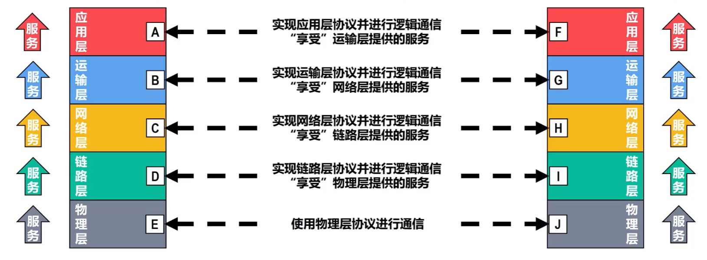
   - 在同一系统中`相邻两层的实体交换信息的逻辑接口`称为服务访问点（Service Access Point，SAP）。经过服务访问点传输的服务数据包，称为服务数据单元（Service Data Unit,SDU）。例如IP数据报的“协议字段是运输层的SAP，TCP报文段或UDP数据报的“端口号”是应用层的SAP。注意：服务访问点不是一个具体的接口，而是上层从哪获取下层信息。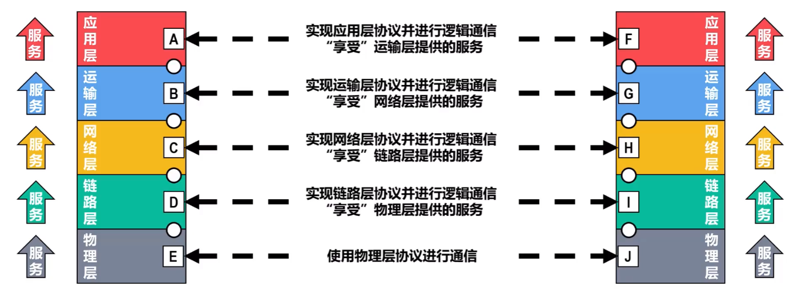
   - 上层要使用下层提供的服务，必须与下层交换一些命令，这些命令称为服务原语。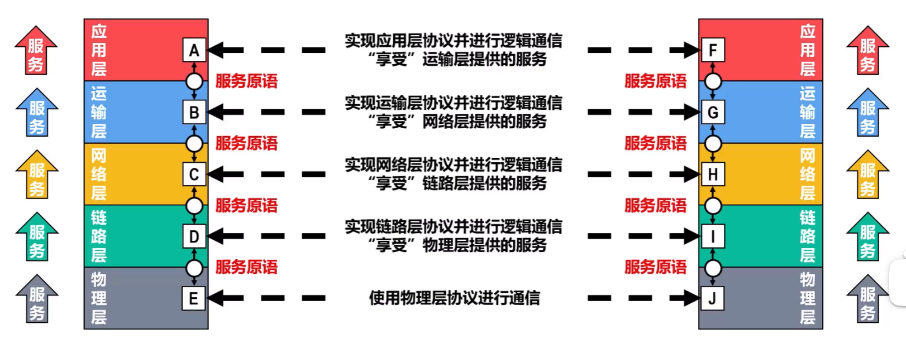
   - 对等层次之间传送的数据包称为该层的数据单元（protocol Data Unit,PDU）。 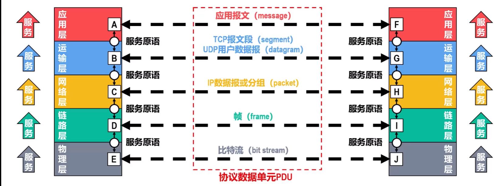
   - 同一系统内层与层之间交换的数据包称为服务数据单元(Service Data Unit ,SDU)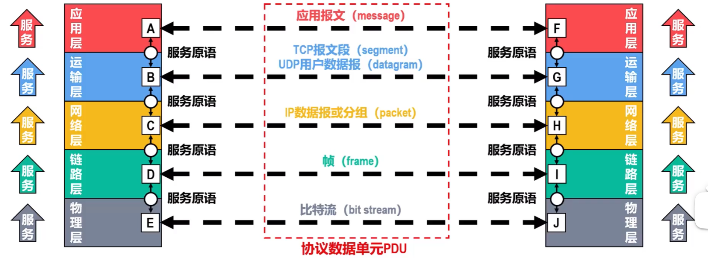

## 1.7 我国的计算机网络发展情况

