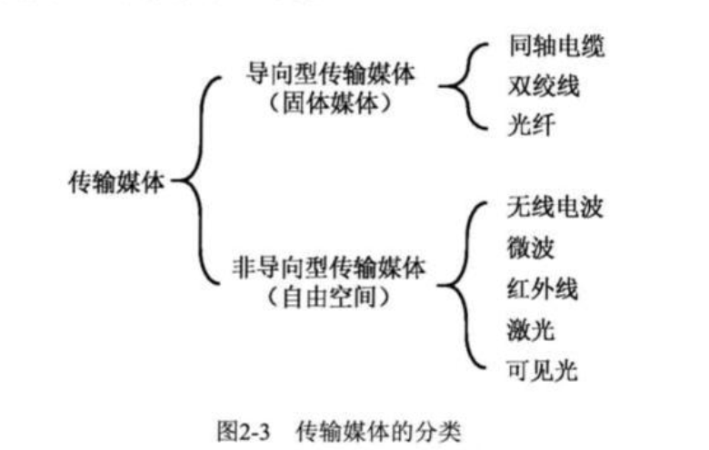
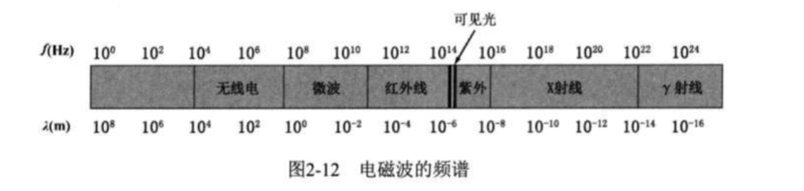
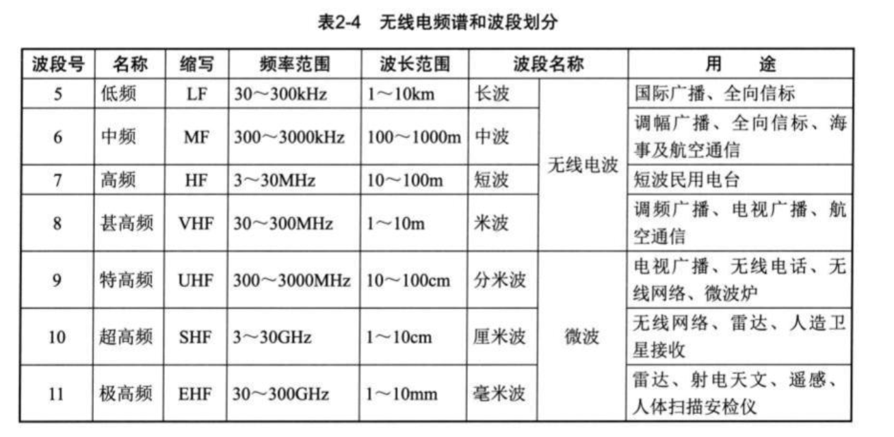
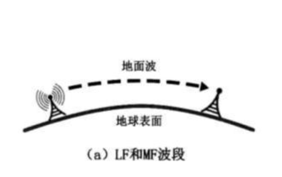
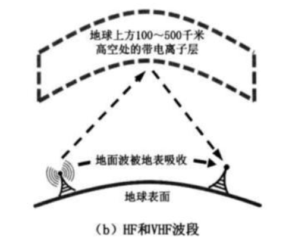
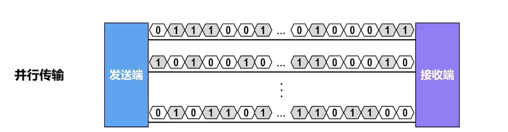
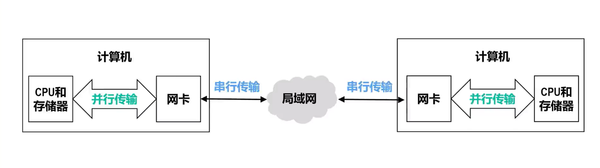
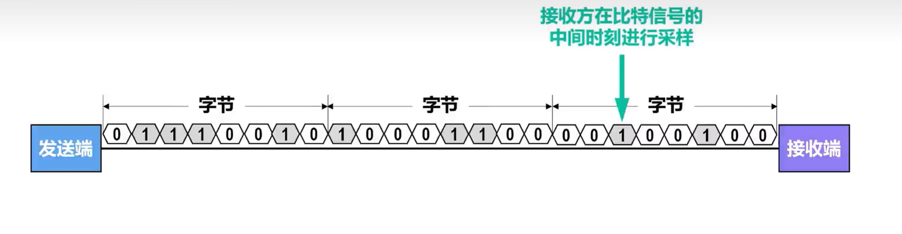
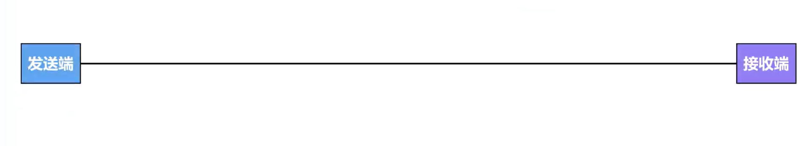
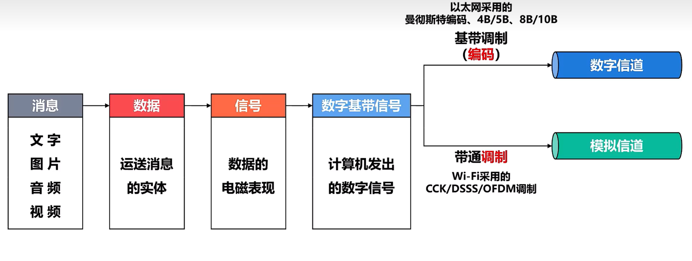

[TOC]
# 第二章 物理层

## 2.1 物理层概述

### 2.1.1 物理层要实现的功能

### 2.1.2 

## 2.2 物理层`下面`的传输媒体

### 2.2.0 传输媒体的分类
- `传输媒体`是计算机网络设备之间的物理通路，也称为传输介质或者传输媒介。
- 传输媒体并`不包含于计算机网络体系结构中`。

### 2.2.1 导向型传输媒体
1. 同轴电缆
淘汰产物，价格、性能、实用性没有一个比得上双绞线的。
2. 双绞线
TODO：非重点，到时候说了要考试再补。
3. 光纤
TODO：非重点，到时候说了要考试再补。
### 2.2.2 非导向型传输媒体
非导向传输媒体只有`电磁波`一种。电磁波谱如下：

$$ C = \lambda f $$
电磁波谱从左到右，电磁波频率逐渐升高，波长对应减小。波长越长的电磁波越容易发生衍射，因而传播距离较长，抗干扰能力较长。
虽然电磁波谱只有一种，但是电磁波可以根据频率被划分为很多个波段。其中用于通信用途最为广泛的无线电波进一步可以被划分为多个波段。

1. 无线电波（LF,MF,HF,VHF 波段）

   - 频段缩写解释
     - LF: Low Frequence
     - MF: Media Frequence 
     - HF: High Frequence 
     - VHF: Very High Frequence 
     - UHF: Ultra High Frequence
     - SHF： Super High Frequence 
     - EHF: Extreme High Frequence 
   - 传输特性
     -  HF和VHF接近直线传播，易受阻挡，会被雨水吸收。
     -  低频无线电波容易穿透障碍物，但是容易衰减。
   - 对应的传输方式
     - LF和MF主要以地面波的形式传播，不易被地面吸收。
     - HF和VHF主要用电离层的反射传播。
1. 微波
   - 传播特性
     - 直线传播
     - 无法被电离层反射
   - 通信方式
     - 地面站接力传播
     - 卫星通信
2. 红外线（略）
3. 激光（略）
4. 可见光（略）

## 2.3 传输方式

### 按串行并行分类 （分析单位为bit）
- 串行传输
  - 每一个时刻只能同时接受或者发送一个bit
  - 网络流通常使用串行传输，成本低（一根线只能通过一个信号）。
- 并行传输
  - 每一个时刻可以同时发送或者接受多个bit。
  - 计算机内部通常使用并行传输，成本高。

- 串行传输和并行传输的转换
  - 通过网卡进行转换
### 按同步异步分类 （分析单位为Byte）
- 接受字节流的前提
- 同步传输
  - 以**帧**为单位。
  - 发送方与接收方在传输过程中时钟信号始终保持一致
  - 同步时钟信号的方式：
    - 外同步：
    - 内同步：
    - 
- 异步传输
  - 以**字节** 为单位
  - 字节的开始和结束都有用于校准时钟信号的校准位。传输过程的空闲时段，发送方和接收方时钟新号不需要保持一致。
  - 

### 按照单向，双向交替，双向同时通信分类

- 单向通信
- 双向交替通信（半双工）
- 双向同时通信（全双工）

## 2.4 编码与调制

### 基本概念
- 
- 码元
- 

### 常用编码方式
- 双极性不归零编码
  - 时钟同步：无时钟同步功能
  - 信息编码方式，正电平为1，负电平为0.
- 双极性归零编码
  - 时钟同步方式：计算两个零电平的起点的时间间隔作为时钟周期。
  - 信息承载方式：每个码元前半段编码信息，正电平表示1，负电平表示0
- 曼彻斯特编码
  - 时钟同步方式
- 差分曼彻斯特编码
 

## 2.5 信道的极限容量

## 2.6 信道复用技术

### 常见的信道复用技术

- 频分复用
- 时分复用
- 波分复用
- 码分复用

